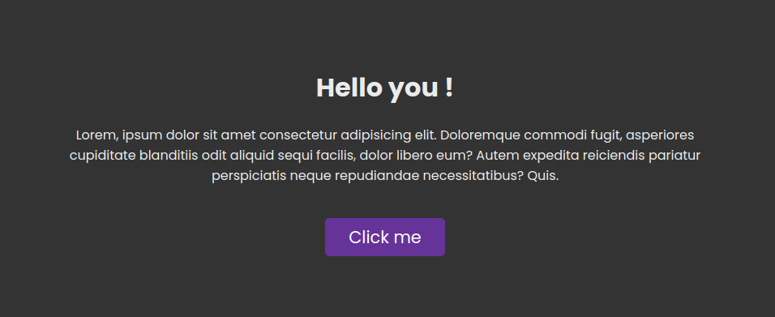

# DarkMode

Ce mini projet consiste à réaliser un bouton pour activer un mode sombre.

Vous pouvez accéder au rendu du site en [cliquant ici](https://guillaumepirard.github.io/dark_mode/ "Rendu du site").

N'hésitez à partager le projet sur Linked-In si vous l'avez aimé ! 

Pour accéder à mon profil Linked-In, [cliquez ici](https://www.linkedin.com/in/guillaume-pirard/ "Mon profil Linked-In") !